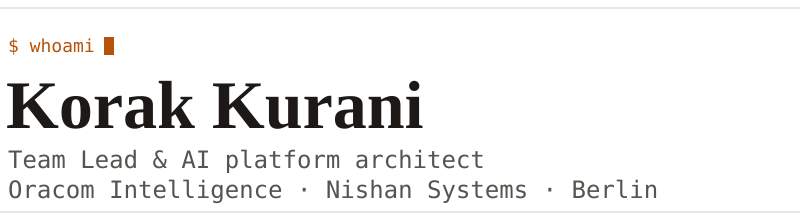

<picture>
  <source media="(prefers-color-scheme: dark)" srcset="assets/banner-dark.svg">
  
</picture>

I lead engineering at Oracom Intelligence and run my own studio, Nishan Systems. I'm based in Berlin.
I care about systems thinking, developer experience, and teams that don't burn out.

<picture>
  <source media="(prefers-color-scheme: dark)" srcset="assets/divider-dark.svg">
  
</picture>

| Leading engineering at Oracom Intelligence | Building Nishan Systems |
| :-- | :-- |
| I lead five developers and own architecture, people management and product decisions. I report to the CEO and set the roadmap with them. | A Berlin studio for software, brand and marketing, founded in September 2026. Morika, a digital loyalty stamp-card product for local merchants in DACH, is in development. |
| [ki.oracom.de](https://ki.oracom.de) | [nishansystems.de](https://nishansystems.de) |
<!-- TODO(verify): confirm ki.oracom.de may be linked publicly -->
<!-- TODO(verify): confirm the first Nishan client may be named; omitted for now -->
<!-- TODO(verify): confirm Morika may be named publicly while in development -->

## What I've built

I joined Oracom when it was a call center. I was a principal architect and hands-on builder of its AI platform, which is in its pre-sales phase.

- **Agent flow builder.** Defines how the AI handles specific situations. Built, then refactored.
- **Device delivery pipeline.** Intake, registration, connection and remote start for on-site AI assistant devices. Major refactor.
- **Door-access integration.** Connects a physical door-access system to the assistant through a Raspberry Pi, with QR scanning and employee-list checks. <!-- TODO(verify): did I build this or lead it? -->
- **Document-to-RAG pipeline.** Document upload, embedding and RAG. I designed it, a teammate built it.
- **Infrastructure rebuild (in progress).** Toward zero downtime, autoscaling and continuous delivery.

## Selected open source

- **[agemon](https://github.com/Korak-997/agemon)** bootstraps an AI coding-agent environment in a repository and cleanly reverses it. TypeScript, MIT, tested, with a dry-run mode. Ubuntu only today. [Install and usage](https://github.com/Korak-997/agemon#install).
- **[qrgen](https://github.com/Korak-997/qrgen)** is a free, ad-free QR code generator built with Vue.

## How I work

- **Systems first.** I look at how the parts interact before I optimise one of them.
- **Developer experience is a feature.** Friction costs the team every day.
- **People first.** I coach daily and protect the team from burnout.
- **Teach the tools.** Nuxt and Tailwind, Git, MCP, agentic AI, RAG, embeddings.

<picture>
  <source media="(prefers-color-scheme: dark)" srcset="assets/divider-dark.svg">
  
</picture>

## Stack

| | |
| :-- | :-- |
| **Daily** |        |
| **Regularly** |     |
| **AI work** |      |
| **Homelab** |    |

## Writing

<!-- TODO(verify): link each post to its own URL; only the /writing index is confirmed -->
- 30 Jun 2026: [Building an AI-Powered Second Brain: Obsidian + Syncthing + Tailscale + Ollama](https://www.korak-kurani.com/writing)
- 30 Apr 2026: [The Invisible Burn: Why DX Is Not Optional](https://www.korak-kurani.com/writing)
- 14 Mar 2026: [The Three-Layer Fortress: Private Cloud with Coolify, Directus and Cloudflare](https://www.korak-kurani.com/writing)

## Connect

- Website: [korak-kurani.com](https://www.korak-kurani.com)
- LinkedIn: [Korak Kurani](https://linkedin.com/in/korak-kurani-94351b235)
- Studio: [Nishan Systems](https://nishansystems.de)
